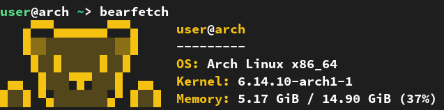

# Bearfetch 🐻  

Tested on Arch Linux, Manjaro, Termux, CachyOS, Artix Linux

**Bearfetch** is a small and cute `fetch` script featuring a bear that displays your system information in a cozy and friendly style.

### Installation:
```bash
git clone https://github.com/relyadev/bearfetch
cd bearfetch
sudo python install.py
